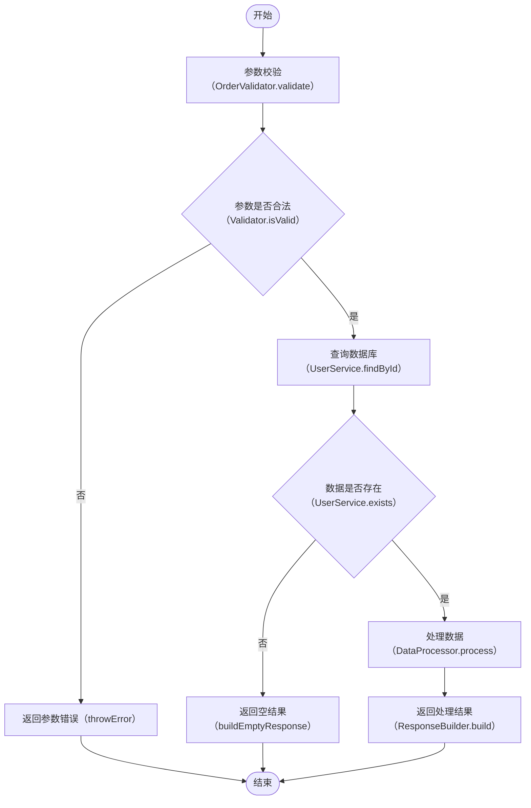

# Code Weave — 代码逻辑整理

将代码的执行流程梳理为结构化的 Mermaid 流程图与功能说明文档，帮助开发者快速理解代码结构。

## 工作流程

### 1. 读取代码

根据用户提供的代码或文件路径，读取需要分析的代码内容。如果用户未提供，询问用户需要分析的代码或文件。

### 2. 分析逻辑

仔细阅读代码，梳理出以下要素：

- **主要流程节点**：代码执行的主干路径，每个关键步骤作为一个节点，并提取该步骤调用/执行的方法名（格式：`类.方法名` 或 `模块.方法名`）
- **分支条件**：if/else、switch/case、try/catch 等条件分支
- **循环结构**：for、while、递归等重复执行的逻辑
- **外部依赖**：调用其他函数、服务、API 等
- **输入与输出**：函数的参数、返回值、副作用
- **配置内容**：代码中引用的配置文件、常量、环境变量、开关等，按作用域归类为「全局配置」或「节点配置」

### 3. 绘制流程图

使用 Mermaid 语法绘制流程图，遵循以下规范：

- **节点文字使用中文**，清晰标明该步骤的功能，同时**在中文后面加上执行的方法名**，格式为：`中文功能名（类.方法名）`。例如：
  - `参数校验（OrderValidator.validate）`
  - `查询数据库（UserService.findById）`
  - `发送通知（EmailSender.sendAsync）`
- 如果步骤是内部逻辑而非调用外部方法，方法名部分写当前类/函数名，例如：`计算总价（processUserOrder.calculatePrice）`
- 对于判断节点，同样标注对应方法或条件表达式，例如：`库存是否充足（ProductService.checkStock）`
- 使用标准流程图符号：
  - 矩形表示处理步骤
  - 菱形表示判断/分支
  - 圆形/圆角矩形表示开始/结束
  - 子流程框表示复杂步骤的嵌套
- 对于复杂流程，使用子图（subgraph）进行分组
- 确保流程图能反映代码的真实执行顺序和分支关系

示例：



### 4. 提取配置内容

在分析代码时，识别所有配置相关内容，包括：

- 配置文件引用（YAML、JSON、Properties、XML 等）
- 环境变量或系统变量
- 常量定义、枚举值
- 开关/特征标记（feature flag）
- 阈值、超时时间、重试次数等参数

**记录规则**：
- 如果配置影响整个流程（如全局超时、数据库连接池、全局开关），归类为**全局配置**，写在「特殊条件与场景」之前
- 如果配置仅影响某个节点（如某接口的单独超时、特定阈值），归类为**节点配置**，写在该节点标题下方
- 配置内容必须使用**代码块**写出，标明配置项的名称、值和含义，例如：

```yaml
# application.yml
order:
  timeout: 30s        # 订单处理超时时间
  max-retry: 3        # 最大重试次数
  feature-flag:
    enable-coupon: true   # 是否启用优惠券功能
```

**如果碰到不清楚的代码或配置含义，不要猜测，必须向用户反复询问确认。** 例如：

> "代码中引用了 `config.special.threshold`，但无法确定其具体含义和业务作用，请确认该配置项的用途和取值规则。"

### 5. 整理节点功能

将流程图中的每个节点展开为独立的小节，标题格式为：**`### 中文功能名（类.方法名）`**。例如：

```markdown
### 查询用户信息（UserService.findById）
```

每个小节包含：

- **功能描述表格**：列出该节点的功能点

| 功能点 | 说明 | 备注 |
|--------|------|------|
| 参数校验 | 检查输入参数是否为空、类型是否正确 | 必填参数不可为空 |
| 长度限制 | 检查字符串长度是否在规定范围内 | 最大长度 100 字符 |

- 对于非常简单的功能点（例如单纯的赋值、返回），可以**总结为一句话**代替表格

### 6. 记录特殊条件与场景

区分两种类型的特殊条件：

- **全局特殊条件**：影响整个流程的条件或场景，写在流程图之后、节点功能说明之前。例如：
  - 需要用户登录后才能执行
  - 并发场景下的锁机制
  - 外部服务不可用的降级策略
  
- **节点特殊场景**：仅影响某个特定节点的条件，写在该节点的功能说明下方。例如：
  - 查询数据库时网络超时
  - 处理大数据量时的分页逻辑
  - 特定参数组合下的特殊处理

### 7. 输出与保存

将最终内容组织为 Markdown 格式，包含以下结构：

```markdown
# [代码名称/文件名称] 逻辑整理

## 概述

[一句话概括这段代码的作用]

## 流程图

```mermaid
[流程图内容，节点标注 中文功能名（类.方法名）]
```

## 全局配置

[如有全局配置，在此用代码块列出]

## 特殊条件与场景

[全局特殊条件，如有]

## 流程节点说明

### [中文功能名（类.方法名）]

[节点配置，如有，用代码块列出]

[表格或一句话说明]

#### 特殊场景

[节点级特殊场景，如有]

### [节点2名称（类.方法名）]

...

## 总结

[可选：对整体逻辑的简要总结]
```

**保存文件前必须确认存放位置**。询问用户：

> "整理完成，共梳理出 N 个流程节点。请确认 Markdown 文件的保存路径（例如 `./docs/flow.md` 或 `/Users/xxx/xxx.md`），我将为您写入文件。"

根据用户提供的绝对路径或相对路径写入文件。如果路径中的目录不存在，先创建目录再写入文件。

## 注意事项

- 分析时应关注代码的**业务逻辑**，而非每一行代码的字面翻译。流程图节点应代表一个业务步骤，而非一行代码。
- **必须准确提取方法名**。如果代码存在多层调用，优先标注当前步骤实际执行的**入口方法名**；如果无法确定方法归属的类/模块，先标注方法名，并向用户确认完整名称。
- **遇到不确定的内容必须询问**。包括：不认识的配置项、含义模糊的方法名、第三方库/框架的隐式调用、缺少上下文的全局变量等。禁止猜测和臆断。
- 中文描述应准确、简洁，避免过度技术化的术语，便于非技术角色也能理解。
- 如果代码过于复杂（超过 20 个主要节点），建议先绘制高层级概览图，再对关键子流程单独展开。
- 如果用户提供了多个文件或整个项目，先询问用户希望分析哪个部分（整体架构、某个模块、某个函数），避免输出过于冗长。
- 如果代码包含明显的业务术语，保留原术语并在首次出现时加以解释。
- 如果用户未指定文件保存位置，默认询问用户当前工作目录下的合适位置，例如 `./docs/code-weave-[filename].md`。
