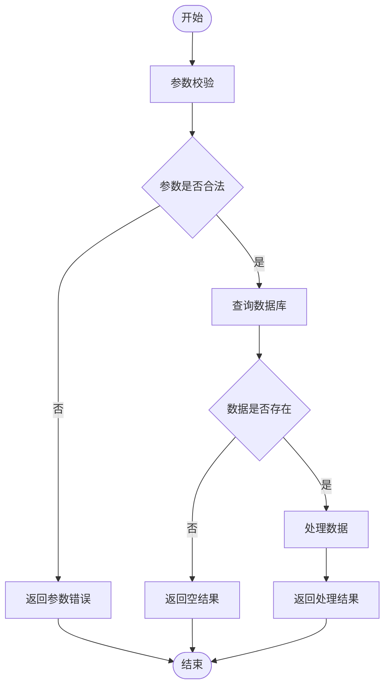

# Code Weave — 代码逻辑整理

将代码的执行流程梳理为结构化的 Mermaid 流程图与功能说明文档，帮助开发者快速理解代码结构。

## 工作流程

### 1. 读取代码

根据用户提供的代码或文件路径，读取需要分析的代码内容。如果用户未提供，询问用户需要分析的代码或文件。

### 2. 分析逻辑

仔细阅读代码，梳理出以下要素：

- **主要流程节点**：代码执行的主干路径，每个关键步骤作为一个节点
- **分支条件**：if/else、switch/case、try/catch 等条件分支
- **循环结构**：for、while、递归等重复执行的逻辑
- **外部依赖**：调用其他函数、服务、API 等
- **输入与输出**：函数的参数、返回值、副作用

### 3. 绘制流程图

使用 Mermaid 语法绘制流程图，遵循以下规范：

- **节点文字使用中文**，清晰标明该步骤的功能（例如"参数校验"、"查询数据库"、"返回结果"）
- 使用标准流程图符号：
  - 矩形表示处理步骤
  - 菱形表示判断/分支
  - 圆形/圆角矩形表示开始/结束
  - 子流程框表示复杂步骤的嵌套
- 对于复杂流程，使用子图（subgraph）进行分组
- 确保流程图能反映代码的真实执行顺序和分支关系

示例：



### 4. 整理节点功能

将流程图中的每个节点展开为独立的小节，标题使用节点名称。每个小节包含：

- **功能描述表格**：列出该节点的功能点

| 功能点 | 说明 | 备注 |
|--------|------|------|
| 参数校验 | 检查输入参数是否为空、类型是否正确 | 必填参数不可为空 |
| 长度限制 | 检查字符串长度是否在规定范围内 | 最大长度 100 字符 |

- 对于非常简单的功能点（例如单纯的赋值、返回），可以**总结为一句话**代替表格

### 5. 记录特殊条件与场景

区分两种类型的特殊条件：

- **全局特殊条件**：影响整个流程的条件或场景，写在流程图之后、节点功能说明之前。例如：
  - 需要用户登录后才能执行
  - 并发场景下的锁机制
  - 外部服务不可用的降级策略
  
- **节点特殊场景**：仅影响某个特定节点的条件，写在该节点的功能说明下方。例如：
  - 查询数据库时网络超时
  - 处理大数据量时的分页逻辑
  - 特定参数组合下的特殊处理

### 6. 输出与保存

将最终内容组织为 Markdown 格式，包含以下结构：

```markdown
# [代码名称/文件名称] 逻辑整理

## 概述

[一句话概括这段代码的作用]

## 流程图

```mermaid
[流程图内容]
```

## 特殊条件与场景

[全局特殊条件，如有]

## 流程节点说明

### [节点1名称]

[表格或一句话说明]

#### 特殊场景

[节点级特殊场景，如有]

### [节点2名称]

...

## 总结

[可选：对整体逻辑的简要总结]
```

**保存文件前必须确认存放位置**。询问用户：

> "整理完成，共梳理出 N 个流程节点。请确认 Markdown 文件的保存路径（例如 `./docs/flow.md` 或 `/Users/xxx/xxx.md`），我将为您写入文件。"

根据用户提供的绝对路径或相对路径写入文件。如果路径中的目录不存在，先创建目录再写入文件。

## 注意事项

- 分析时应关注代码的**业务逻辑**，而非每一行代码的字面翻译。流程图节点应代表一个业务步骤，而非一行代码。
- 中文描述应准确、简洁，避免过度技术化的术语，便于非技术角色也能理解。
- 如果代码过于复杂（超过 20 个主要节点），建议先绘制高层级概览图，再对关键子流程单独展开。
- 如果用户提供了多个文件或整个项目，先询问用户希望分析哪个部分（整体架构、某个模块、某个函数），避免输出过于冗长。
- 如果代码包含明显的业务术语，保留原术语并在首次出现时加以解释。
- 如果用户未指定文件保存位置，默认询问用户当前工作目录下的合适位置，例如 `./docs/code-weave-[filename].md`。
