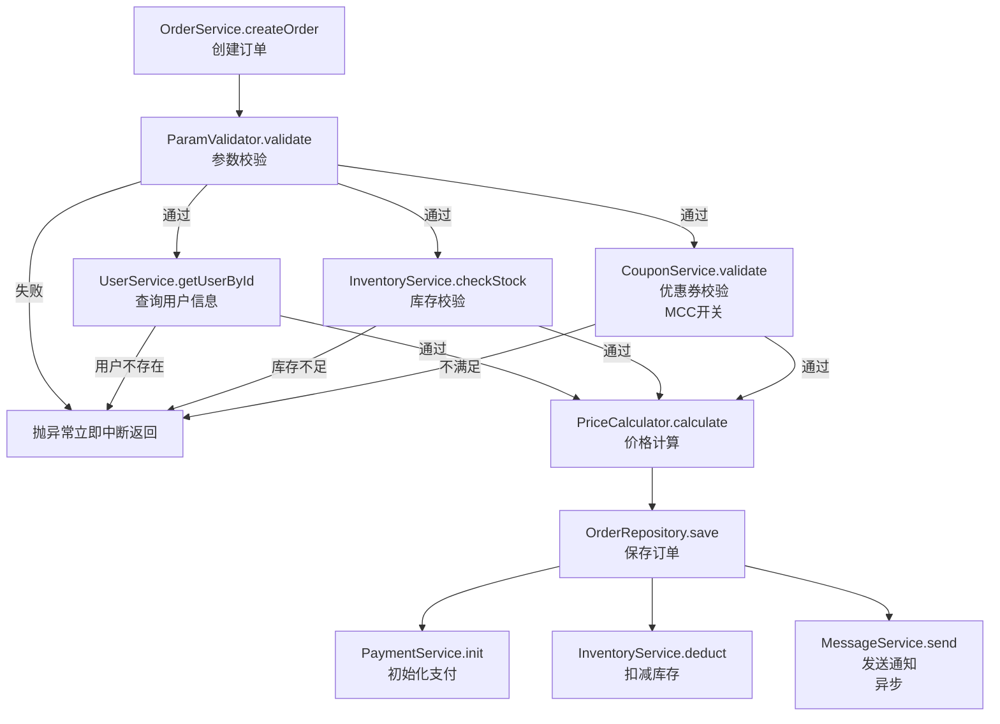

# Code Weave — 代码逻辑整理

将代码的执行流程梳理为结构化的 Mermaid 流程图与功能说明文档，帮助开发者快速理解代码结构。

## 工作流程

### 1. 读取代码

根据用户提供的代码或文件路径，读取需要分析的代码内容。如果用户未提供，询问用户需要分析的代码或文件。

### 2. 分析逻辑

仔细阅读代码，梳理出以下要素：

- **主要流程节点**：代码执行的主干路径，每个关键步骤作为一个节点，并提取该步骤调用/执行的方法名（格式：`类.方法名` 或 `模块.方法名`）。**仅统计具有业务功能的节点**（如参数校验、业务规则校验、价格计算、订单创建等），忽略纯技术性操作（如单纯的 try/catch 异常捕获、数据类型转换、JSON 序列化/反序列化、无业务含义的包装/解包等）。
- **分支条件**：if/else、switch/case、try/catch 等条件分支（**注意：try/catch 在流程图中仅保留有业务中断意义的异常路径，纯捕获/包装不入图**）
- **循环结构**：for、while、递归等重复执行的逻辑
- **外部依赖**：调用其他函数、服务、API 等
- **输入与输出**：函数的参数、返回值、副作用
- **配置内容**：代码中引用的配置文件、常量、环境变量、开关等，按作用域归类为「全局配置」或「节点配置」
- **数据库操作**：识别所有涉及的数据库表名及操作类型（查询、插入、更新、删除）
- **校验逻辑**：识别所有的校验逻辑，特别关注是否包含提示信息（错误提示、异常信息等）

### 2.5 逐行提取编排方法的调用序列（必须执行）

对于代码中担任"串行编排多个子步骤"角色的方法（常见特征：方法体内依次调用 5 个以上子方法，如 `invokeValidate()`、`processOrder()`、`execute()` 等），**必须通过 Read 工具读取其完整方法体**，然后按代码行顺序逐行列出所有方法调用，生成原始调用序列清单：

```
方法：BizEnrollValidator.invokeValidate()   ← 示例，实际替换为分析的方法
调用序列（按代码行顺序，逐行摘抄，不允许归纳省略）：
  1. checkAuth()               ← 第262行
  2. checkRequired()           ← 第264行
  3. checkScheduleConstraint() ← 第266行
  ...（每一行方法调用都必须列出）
```

⚠️ **硬性约束**：
- **禁止**靠记忆或理解归纳此清单，必须先 Read 文件，后逐行摘抄方法调用
- **禁止**省略任何方法调用（无论该方法看起来多么简单或像空实现）
- 此清单是后续流程图节点和文档章节的**唯一事实来源**，后续步骤中任何与清单不符的内容均视为错误

如果用户分析的代码中**不存在**这类编排方法，可跳过本步骤，直接进入 Step 3。

### 3. 绘制流程图

使用 Mermaid 语法绘制流程图，遵循以下规范：

- **只统计有业务功能的节点**。判断标准是：**"这个方法是否包含业务条件判断、业务规则验证或业务异常抛出？"** 若否，一律忽略。以下类型无论方法名是否含业务术语，均忽略：
  - **纯技术性操作**：try/catch 异常捕获、类型转换、序列化/反序列化、包装/解包
  - **纯数据查询**：仅去 DB/RPC/Session 取数据、自身无业务判断（常见形式：`queryXxx`、`getXxx`、`loadXxx`、`fetchXxx`）
  - **初始化/上下文准备**：`init`、`setUp`、`buildContext` 等，仅做数据加载，不含业务判断
  - **数据分组/聚合**：按字段做 `groupingBy`、`collect` 等，无业务判断
  - **结果合并**：`mergeResult`、`Map.putAll` 等，无业务逻辑
  - **结果构建/格式转换**：`buildXxx`、`convertXxx`、纯数据结构组装，无业务逻辑
  - **return 语句/终止节点**：流程末尾的「返回 XXX」不作为节点，流程自然结束即可；仅保留异常中断路径（如「抛异常立即中断返回」）
- **入口方法作为第一个节点**，标注 `类.方法名<br>中文功能名`，不加序号。
- **后续节点文字使用中文** 节点格式为 `["类.方法名<br>中文功能名"]`。方法名在第一行，中文描述在第二行，用 `<br>` 标签换行（不使用 `\n`）。例如：
  - `["OrderValidator.validate<br>参数校验"]`
  - `["UserService.findById<br>查询用户信息"]`
  - `["CommonParamValidator.baseParamCheck<br>基础参数校验"]` 如果类名加方法名的长度大于26, 则格式改为 `["CommonParamValidator<br>.baseParamCheck<br>基础参数校验"]`
- **并行子节点**：当某节点向多个同级子步骤展开时，用 `&` 连接（如 `D --> E1 & E2 & E3`），子节点格式与普通节点一致，标注 `类.方法名<br>中文功能名`。**即使代码中是顺序执行，只要这些步骤在业务上处于同一逻辑层级（如同一校验链中的各校验方法），也应用 `&` 并排展示，而不是画成串行链**。
- **分支标注**：用 `|标签|` 表达分支走向（如 `|失败|`、`|通过|`）。
- **特殊条件标注**：如节点有前提条件或开关控制（如"MCC开关"、"异步"等），在中文描述下方用 `<br>` 追加一行注明，如 `["CouponService.validate<br>优惠券校验<br>MCC开关"]`。
- **不使用 Start/End 节点**，流程从入口方法自然展开、自然结束。
- **异常返回及终止节点**：如"抛异常立即中断返回"、"返回订单创建成功"等非业务方法节点，仅标注中文描述，不需要加 `类.方法名`。
- 确保流程图能反映代码的真实执行顺序和分支关系。

> ⚠️ **以下仅为节点格式的示例，禁止将示例内容复制到输出文档中。**
> 示例中的 `OrderService`、`UserService`、`InventoryService` 等均为虚构类名，不对应任何真实代码。
> 输出文档中的每个节点，必须来自对实际代码的分析，不得照搬此处示例。

示例（仅供参考节点格式，禁止照搬）：



### 4. 提取配置内容

在分析代码时，识别所有配置相关内容，包括：

- 配置文件引用（YAML、JSON、Properties、XML 等）
- 环境变量或系统变量
- 常量定义、枚举值
- 开关/特征标记（feature flag）
- 阈值、超时时间、重试次数等参数

**记录规则**：
- 如果配置影响整个流程（如全局超时、数据库连接池、全局开关），归类为**全局配置**，写在「一、整体流程图」中流程图之后、全局特殊条件之前
- 如果配置仅影响某个节点（如某接口的单独超时、特定阈值），归类为**节点配置**，写在该节点标题下方
- 配置内容必须使用**代码块**写出，标明配置项的名称、值和含义，例如：

```yaml
# application.yml
order:
  timeout: 30s        # 订单处理超时时间
  max-retry: 3        # 最大重试次数
  feature-flag:
    enable-coupon: true   # 是否启用优惠券功能
```

**如果碰到不清楚的代码或配置含义，不要猜测，必须向用户反复询问确认。** 例如：

> "代码中引用了 `config.special.threshold`，但无法确定其具体含义和业务作用，请确认该配置项的用途和取值规则。"

### 5. 整理节点功能

将流程图中的每个节点展开为独立的小节，放在「二、流程节点说明」下。标题格式为：**`## 2.X 中文功能名（类.方法名）`**（X 为该节点在同级中的序号）。例如：

```markdown
## 2.1 查询用户信息（UserService.findById）
```

每个小节按以下顺序组织内容：

1. **一句话功能描述（必须）**：简洁说明该节点的功能，如有开关控制也可写在这里
2. **功能描述表格（必须，非校验类极简功能点除外）**：列出该节点的功能点。对于**校验逻辑**，表格的基础表头固定为（**必须包含「序号」列，从 1 开始顺序编号**）：

| 序号 | 校验项 | 校验逻辑 | 提示信息 | 中断方式 |
|------|--------|----------|----------|----------|
| 1 | 用户非空校验 | 检查 `userId` 是否为空 | 用户不存在 | 抛异常（`throw new Error`） |
| 2 | 用户状态校验 | 检查 `user.status` 是否等于 `banned` | 用户已被封禁，无法下单 | 抛异常（`throw new Error`） |

**行号规则**：
- 每张校验表格的第一列固定为「序号」，从 1 开始**连续**编号，步长为 1
- 同一个节点下若存在多张子表格（如按提报形式分 SKU / 蓝莓），各子表格**各自独立从 1 开始**编号，不跨表连续
- 「序号」列仅用于校验表格；数据库表说明、相关代码文件等非校验表格**不加序号**

**表格合并原则**：当同一节点下存在多张结构相同的校验表、仅在某个维度（如提报形式、操作场景、用户类型等）上存在差异时，**优先合并为一张多行表并新增维度列**，而非拆成多张独立表格。

- **判断标准**：若多张表的列名完全相同，且差异来源于某个可枚举的维度（如「SKU提报 / 蓝莓提报」「新提报 / 编辑」），则应合并
- **合并方式**：删除各子表的独立表名，改为在表格中新增一列或多列维度列（如「提报形式」「操作场景」），各行的序号统一全局连续编号
- **不合并的情况**：若多张表列名不同，或差异无法用单一维度列描述，则保持独立表格，各表序号各自从 1 开始

**提示信息溯源要求**（⚠️ 必须遵守）：校验表格中"提示信息"列的内容，**必须来自方法体中实际使用的字符串字面量或常量引用**，步骤如下：
1. 通过 Read 工具读取该校验方法的完整方法体
2. 定位到实际触发提示的代码行（如 `throw new XxxException("消息")` 或 `setError(Consts.XXX_MSG)` 等）
3. 记录该行中**实际引用**的字符串内容或常量名，而非在常量类中"看起来相关"的常量

禁止以下行为：
- 在常量类中发现语义相似的常量，就假设校验方法用了它（须反向确认方法体引用了哪个常量）
- 凭理解或推断写出错误消息，而非从代码行读取

对于**非校验类节点**（如保存订单、发送通知、价格计算等），表头自由定义，建议包含「序号」「功能点」「说明」两列，例如：

| 序号 | 功能点 | 说明 |
|----|--------|------|
| 1  | 写入订单记录 | 插入 `orders` 表，含价格、状态等字段 |
| 2  | 扣减库存 | 调用 `InventoryService.deduct` 更新库存数量 |

3. **节点配置（可选）**：如果该节点有专属配置，用代码块列出
4. **特殊条件与场景（可选）**：如有节点级特殊条件，用加粗内联格式列出

**当一个大的校验节点下包含多个小的校验子节点时**，使用层级展开：大节点用 `## 2.X`，子节点用 `### 2.X.Y`。大节点按上述四步顺序展开，各步必须/可选如下：**① 一句话总结功能（必须）、② 功能描述表格（可选）、③ 节点配置（可选）、④ 特殊条件与场景（可选）**。子节点同样按上述四步顺序完整展开。

```markdown
## 2.3 大的校验节点名称（类.方法名）

[必须，一句话总结功能]

### 2.3.1 小的校验节点1名称（类.方法名）

[必须，一句话说明功能]

[必须，表格]

[可选，节点配置]

[可选，特殊条件与场景]

### 2.3.2 小的校验节点2名称（类.方法名）

...
```

**变量名中文化规则**：在校验逻辑中，所有变量名、字段名、参数名必须替换为中文，不得直接暴露代码标识符。替换后的中文关键字用「」包裹标注，以区分业务术语与普通描述文字。**此规则同时适用于表格「校验逻辑」列和文档正文（特殊条件、节点描述等非表格文本）**。

**替换步骤**：
1. 读取字段在代码中的注释（Javadoc、行注释、`@ApiModelProperty` 等），以注释内容作为中文含义
2. 若无注释，结合类名、方法名、上下文推断中文含义
3. 用中文含义**完整替换**变量名，并用「」包裹该中文关键字

**单字段条件**，格式为 `「中文含义」判断条件`：

- `enrollItems` 注释为「提报商品」，条件为不为空 → `「提报商品」列表不为空`
- `skuId` 推断为「SKU ID」，条件为合法 → `「SKU ID」不为空且 > 0`
- `scheduleId` 注释为「活动ID」，条件为存在 → `「活动ID」对应档期存在`
- `markingStime` 注释为「打标开始时间」，条件为早于结束时间 → `「打标开始时间」早于「打标结束时间」`

**多字段组合条件**（如联合唯一键），用 + 连接各字段中文名，整体用「」包裹：

- `scheduleId + skuId + areaId` 三元组唯一 → `「活动 + SKU + 城市」在本次请求中唯一`
- `scheduleId + areaId + extItemId` 三元组唯一 → `「活动 + 城市 + 蓝莓」在本次请求中唯一`

**非表格正文**（特殊条件、节点描述）中出现的判断条件同样替换：

- 正文中 `（enrollId > 0，即 isUpdate() == true）` → `（「提报单ID」> 0）`
- 正文中 `（activityType = MARKING_ACTIVITY）` → `（「活动类型」为「打标活动」）`
- 正文中 `（enrollForm）分支` → `（「提报物料形式」）分支`

**不替换的情况**：
- MCC 配置键名（如 `n.enroll.check.rule.switch`）保留原名，因为它们是运维配置项，需要与线上配置一一对应
- 类名.方法名格式的引用（如 `ExtItemFormValidator.checkAccessRule`）保留，因为它们是代码定位线索
- 枚举值（如 `DRAFT`、`REJECT`）可保留，但需在旁边用括号注明中文含义

**强制要求**：如果校验逻辑包含提示信息（错误提示、异常信息等），那么该校验条件**不允许跳过**，必须完整记录在流程图和文档中。如果只是单纯的防御型校验（无提示信息、无业务中断逻辑），可以忽略。

- 输出部分校验内容后，**询问用户是否需要新增表头**：
  > "以上校验逻辑已按基础表头（序号、校验项、校验逻辑、提示信息、中断方式）整理。是否需要新增其他表头（例如校验类型、优先级、影响范围、后续处理等）？如需新增，请说明表头名称。"

- 对于非校验类的非常简单的功能点（例如单纯的赋值、返回），可以**总结为一句话**代替表格

### 6. 记录特殊条件与场景

区分两种类型的特殊条件，格式统一为 **条件或场景描述**: 描述内容。如果有多条，使用列表展示：

- **全局特殊条件**：影响整个流程的条件或场景，写在「一、整体流程图」的流程图之后、**全局配置之后**（若有全局配置，配置在前，特殊条件在后）。例如：
  - **登录要求**：需要用户登录后才能执行
  - **并发控制**：并发场景下使用分布式锁机制
  - **降级策略**：外部服务不可用时走本地缓存降级

- **节点特殊场景**：仅影响某个特定节点的条件，写在该节点的功能说明下方。例如：
  - **网络超时**：查询数据库时设置 3s 超时
  - **分页处理**：处理大数据量时按 500 条分页
  - **特殊参数组合**：当 type=3 时跳过价格校验

### 7. 记录数据库表说明

如果代码逻辑中涉及数据库操作，在文档中新增「数据库表说明」章节，使用表格列出所有涉及的表：

| 表名 | 描述 |
|------|------|
| users | 用户信息表，存储用户基础数据及状态 |
| products | 商品信息表，存储商品基础数据及库存 |
| orders | 订单表，存储订单记录及价格信息 |
| coupons | 优惠券表，存储优惠券类型、规则及有效期 |

### 8. 记录相关代码文件

在文档末尾新增「相关代码文件」章节，使用表格列出本次分析涉及的所有代码文件：

| 类/文件 | 说明 |
|---------|------|
| OrderService.java | 订单处理服务，包含 `processUserOrder` 等核心方法 |
| UserDao.java | 用户数据访问层，提供用户查询接口 |
| ProductDao.java | 商品数据访问层，提供商品及库存查询接口 |

### 9. 保存前内容核实（必须执行，不可跳过）

在向用户确认路径并保存文件之前，执行以下三项核实（目的：从"文档→代码"反向验证，弥补正向生成时的遗漏和错误）：

**核实1：流程图节点的存在性**

对流程图中每个 `类.方法名` 格式的节点，执行存在性验证：
```bash
grep -r "方法名" --include="*.java" <项目路径>
```
若 grep 无结果，从流程图中删除该节点并在核实报告中说明原因。

**核实2：编排方法的调用完整性**

若 Step 2.5 生成了调用序列原始清单，将其与文档中对应章节的子步骤列表逐一比对：
- 清单中有、文档中无 → 补充缺失步骤
- 数量不一致（如清单 10 步、文档仅 8 步）→ 逐条排查并补全

**核实3：错误消息的准确性**

对文档表格中每条"提示信息"，在对应方法体中验证其来源：
```bash
grep -r "提示信息字符串" --include="*.java" <项目路径>
```
若 grep 无结果，说明该消息由推断而非代码给出，将该格标记为 `⚠️ 待确认` 并向用户说明。

核实完成后，向用户汇报结果再继续：
> "核实完成：共校验 N 个节点、M 条错误消息，发现并修正 X 处（列出修正内容）。请确认后继续保存。"

### 10. 输出与保存

将最终内容组织为 Markdown 格式，使用四个一级标题章节，标题使用中文数字序号：

- **一级标题**：`# 一、`、`# 二、`、`# 三、`、`# 四、`
- **二级标题**：`## 2.1`、`## 2.2`（仅「二、流程节点说明」下使用）
- **三级标题**：`### 2.3.1`、`### 2.3.2`（大校验节点的子节点使用）

**「一、整体流程图」标题下方紧跟入口方法描述**，用一句话说明该方法的职责。

完整结构如下：

```markdown
# 一、整体流程图

**入口方法**：`类.方法名` — [一句话概括该方法的作用]

```mermaid
[流程图内容，入口方法为第一个节点]
```

[可选，如果有配置信息，在此用代码块列出]

[可选，如有全局特殊条件与场景，在此列出，样式：**条件或场景描述**: 描述内容，如果有多条使用列表展示]

# 二、流程节点说明

## 2.1 中文功能名（类.方法名）

[必须，一句话说明功能，如果有类似开关的功能，也可以写在这里]

[必须，表格]

[可选，节点配置，如有，用代码块列出]

[可选，如有节点级特殊条件与场景，在此列出，样式：**条件或场景描述**: 描述内容，如果有多条使用列表展示]

## 2.2 节点2名称（类.方法名）

...

## 2.3 大的校验节点名称（类.方法名）

[必须，一句话总结功能]

[可选，表格]

[可选，节点配置，如有，用代码块列出]

[可选，如有节点级特殊条件与场景，在此列出，样式：**条件或场景描述**: 描述内容，如果有多条使用列表展示]

### 2.3.1 小的校验节点1名称（类.方法名）

[必须，一句话说明功能，如果有类似开关的功能，也可以写在这里]

[必须，表格]

[可选，节点配置，如有，用代码块列出]

[可选，如有节点级特殊条件与场景，在此列出，样式：**条件或场景描述**: 描述内容，如果有多条使用列表展示]

### 2.3.2 小的校验节点2名称（类.方法名）

...

# 三、数据库表说明

| 表名 | 描述 |
|------|------|
| ... | ... |

# 四、相关代码文件

| 类/文件 | 说明 |
|---------|------|
| ... | ... |
```

**保存文件前必须确认存放位置**。询问用户：

> "整理完成，共梳理出 N 个流程节点。请确认 Markdown 文件的保存路径（例如 `./docs/flow.md` 或 `/Users/xxx/xxx.md`），我将为您写入文件。"

根据用户提供的绝对路径或相对路径写入文件。如果路径中的目录不存在，先创建目录再写入文件。

## 注意事项

- **Step 2.5 和 Step 9 是强制步骤**，不可因"代码简单"或"时间紧迫"跳过。这两步是防止幻觉内容和遗漏步骤的核心防线：Step 2.5 确保编排方法的调用序列完整，Step 9 确保文档中的类/方法名、错误消息与代码一一对应。
- 分析时应关注代码的**业务逻辑**，而非每一行代码的字面翻译。流程图节点应代表一个业务步骤，而非一行代码。
- **流程图中只统计有业务功能的节点**，忽略规则详见「Step 3 绘制流程图」。
- ⚠️ **警惕合理化陷阱**：当你为某个技术节点找到了「业务理由」时要特别警惕，这往往是在为应该忽略的节点辩护。典型错误：把「查询档期信息」保留，理由是「它是后续校验的数据前提」；把「按活动类型分组」保留，理由是「它决定了走哪个分支」。数据前提和技术路由都不是业务逻辑，应忽略。
- **必须准确提取方法名**。如果代码存在多层调用，优先标注当前步骤实际执行的**入口方法名**；如果无法确定方法归属的类/模块，先标注方法名，并向用户确认完整名称。
- **遇到不确定的内容必须询问**。包括：不认识的配置项、含义模糊的方法名、第三方库/框架的隐式调用、缺少上下文的全局变量等。禁止猜测和臆断。
- 中文描述应准确、简洁，避免过度技术化的术语，便于非技术角色也能理解。
- 如果代码过于复杂（超过 20 个主要节点），建议先绘制高层级概览图，再对关键子流程单独展开。
- 如果用户提供了多个文件或整个项目，先询问用户希望分析哪个部分（整体架构、某个模块、某个函数），避免输出过于冗长。
- 如果代码包含明显的业务术语，保留原术语并在首次出现时加以解释。
- 如果用户未指定文件保存位置，默认询问用户当前工作目录下的合适位置，例如 `./docs/code-weave-[filename].md`。
