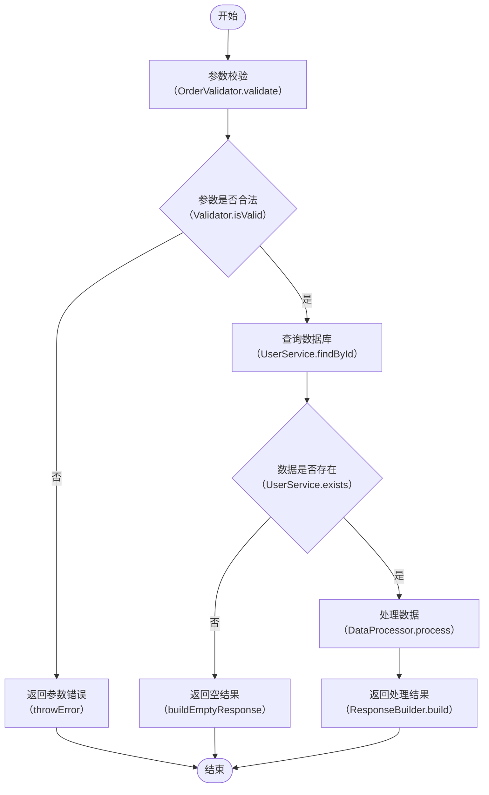

# Code Weave — 代码逻辑整理

将代码的执行流程梳理为结构化的 Mermaid 流程图与功能说明文档，帮助开发者快速理解代码结构。

## 工作流程

### 1. 读取代码

根据用户提供的代码或文件路径，读取需要分析的代码内容。如果用户未提供，询问用户需要分析的代码或文件。

### 2. 分析逻辑

仔细阅读代码，梳理出以下要素：

- **主要流程节点**：代码执行的主干路径，每个关键步骤作为一个节点，并提取该步骤调用/执行的方法名（格式：`类.方法名` 或 `模块.方法名`）。**仅统计具有业务功能的节点**（如参数校验、数据查询、价格计算、订单创建等），忽略纯技术性操作（如单纯的 try/catch 异常捕获、数据类型转换、JSON 序列化/反序列化、无业务含义的包装/解包等）。
- **分支条件**：if/else、switch/case、try/catch 等条件分支
- **循环结构**：for、while、递归等重复执行的逻辑
- **外部依赖**：调用其他函数、服务、API 等
- **输入与输出**：函数的参数、返回值、副作用
- **配置内容**：代码中引用的配置文件、常量、环境变量、开关等，按作用域归类为「全局配置」或「节点配置」
- **数据库操作**：识别所有涉及的数据库表名及操作类型（查询、插入、更新、删除）
- **校验逻辑**：识别所有的校验逻辑，特别关注是否包含提示信息（错误提示、异常信息等）

### 3. 绘制流程图

使用 Mermaid 语法绘制流程图，遵循以下规范：

- **只统计有业务功能的节点**。如果一个流程节点中没有业务功能（如纯异常捕获、数据类型转换、无业务含义的包装），忽略此节点。
- **节点文字使用中文**，清晰标明该步骤的功能，同时**在中文后面加上执行的方法名**，格式为：`中文功能名（类.方法名）`。如果节点文字较长，使用 Mermaid 的 `<br>` 标签换行展示。例如：
  - `参数校验<br>（OrderValidator.validate）`
  - `查询数据库<br>（UserService.findById）`
  - `发送通知<br>（EmailSender.sendAsync）`
- 如果步骤是内部逻辑而非调用外部方法，方法名部分写当前类/函数名，例如：`计算总价<br>（processUserOrder.calcPrice）`
- 对于判断节点，同样标注对应方法或条件表达式，例如：`库存是否充足<br>（ProductService.checkStock）`
- 使用标准流程图符号：
  - 矩形表示处理步骤
  - 菱形表示判断/分支
  - 圆形/圆角矩形表示开始/结束
  - 子流程框表示复杂步骤的嵌套
- 对于复杂流程，使用子图（subgraph）进行分组
- 确保流程图能反映代码的真实执行顺序和分支关系

示例：



### 4. 提取配置内容

在分析代码时，识别所有配置相关内容，包括：

- 配置文件引用（YAML、JSON、Properties、XML 等）
- 环境变量或系统变量
- 常量定义、枚举值
- 开关/特征标记（feature flag）
- 阈值、超时时间、重试次数等参数

**记录规则**：
- 如果配置影响整个流程（如全局超时、数据库连接池、全局开关），归类为**全局配置**，写在「特殊条件与场景」之前
- 如果配置仅影响某个节点（如某接口的单独超时、特定阈值），归类为**节点配置**，写在该节点标题下方
- 配置内容必须使用**代码块**写出，标明配置项的名称、值和含义，例如：

```yaml
# application.yml
order:
  timeout: 30s        # 订单处理超时时间
  max-retry: 3        # 最大重试次数
  feature-flag:
    enable-coupon: true   # 是否启用优惠券功能
```

**如果碰到不清楚的代码或配置含义，不要猜测，必须向用户反复询问确认。** 例如：

> "代码中引用了 `config.special.threshold`，但无法确定其具体含义和业务作用，请确认该配置项的用途和取值规则。"

### 5. 整理节点功能

将流程图中的每个节点展开为独立的小节，标题格式为：**`### 5.X 中文功能名（类.方法名）`**（其中 X 为该节点在同级中的序号）。例如：

```markdown
### 5.1 查询用户信息（UserService.findById）
```

每个小节包含：

- **节点配置**：如果该节点有专属配置，用代码块列出
- **功能描述表格**：列出该节点的功能点。对于**校验逻辑**，表格的基础表头固定为：

| 校验项 | 校验逻辑 | 提示信息 | 中断方式 |
|--------|----------|----------|----------|
| 用户非空校验 | 检查 `userId` 是否为空 | 用户不存在 | 抛异常（`throw new Error`） |
| 用户状态校验 | 检查 `user.status` 是否等于 `banned` | 用户已被封禁，无法下单 | 抛异常（`throw new Error`） |

**字段注释提取规则**：在校验逻辑中，如果判断某个字段是否为空（或长度、范围等），优先读取该字段在代码中的注释（如 Javadoc、行注释、属性注解等）。在校验逻辑列中，将字段注释补充到字段名后面，使用中文引号「」包裹，格式为 `字段名「注释内容」判断条件`。例如：

- `enrollItems` 的注释为「提报商品」，判断条件为不为空，则写：`enrollItems「提报商品」> 0` 或 `enrollItems「提报商品」不能为空`
- `userId` 的注释为「用户ID」，判断条件为是否为空，则写：`userId「用户ID」不能为空`

如果没有找到字段注释，原封不动展示字段名和判断条件，例如：`userId 不能为空`。

**强制要求**：如果校验逻辑包含提示信息（错误提示、异常信息等），那么该校验条件**不允许跳过**，必须完整记录在流程图和文档中。如果只是单纯的防御型校验（无提示信息、无业务中断逻辑），可以忽略。

- 输出部分校验内容后，**询问用户是否需要新增表头**：
  > "以上校验逻辑已按基础表头（校验项、校验逻辑、提示信息、中断方式）整理。是否需要新增其他表头（例如优先级、影响范围、后续处理等）？如需新增，请说明表头名称。"

- 对于非校验类的非常简单的功能点（例如单纯的赋值、返回），可以**总结为一句话**代替表格

### 6. 记录特殊条件与场景

区分两种类型的特殊条件：

- **全局特殊条件**：影响整个流程的条件或场景，写在流程图之后、节点功能说明之前。例如：
  - 需要用户登录后才能执行
  - 并发场景下的锁机制
  - 外部服务不可用的降级策略
  
- **节点特殊场景**：仅影响某个特定节点的条件，写在该节点的功能说明下方。例如：
  - 查询数据库时网络超时
  - 处理大数据量时的分页逻辑
  - 特定参数组合下的特殊处理

### 7. 记录数据库表说明

如果代码逻辑中涉及数据库操作，在文档中新增「数据库表说明」章节，使用表格列出所有涉及的表：

| 表名 | 描述 |
|------|------|
| users | 用户信息表，存储用户基础数据及状态 |
| products | 商品信息表，存储商品基础数据及库存 |
| orders | 订单表，存储订单记录及价格信息 |
| coupons | 优惠券表，存储优惠券类型、规则及有效期 |

### 8. 记录相关代码文件

在文档末尾新增「相关代码文件」章节，使用表格列出本次分析涉及的所有代码文件：

| 类/文件 | 说明 |
|---------|------|
| OrderService.java | 订单处理服务，包含 `processUserOrder` 等核心方法 |
| UserDao.java | 用户数据访问层，提供用户查询接口 |
| ProductDao.java | 商品数据访问层，提供商品及库存查询接口 |

### 9. 输出与保存

将最终内容组织为 Markdown 格式，标题使用如下编号规则：

- **一级标题**：使用中文数字序号，如 `一、`、`二、`、`三、`
- **二级标题**：使用阿拉伯数字层级，如 `1.1`、`1.2`、`2.1`
- **三级标题**：使用阿拉伯数字三级层级，如 `1.1.1`、`1.1.2`

完整结构如下：

```markdown
# 一、[代码名称/文件名称] 逻辑整理

## 1.1 概述

[一句话概括这段代码的作用]

## 1.2 流程图

```mermaid
[流程图内容，节点标注 中文功能名<br>（类.方法名）]
```

## 1.3 全局配置

[如有全局配置，在此用代码块列出]

## 1.4 特殊条件与场景

[全局特殊条件，如有]

## 1.5 流程节点说明

### 1.5.1 中文功能名（类.方法名）

[节点配置，如有，用代码块列出]

[表格或一句话说明]

#### 1.5.1.1 特殊场景

[节点级特殊场景，如有]

### 1.5.2 节点2名称（类.方法名）

...

## 1.6 数据库表说明

| 表名 | 描述 |
|------|------|
| ... | ... |

## 1.7 相关代码文件

| 类/文件 | 说明 |
|---------|------|
| ... | ... |

## 1.8 总结

[可选：对整体逻辑的简要总结]
```

**保存文件前必须确认存放位置**。询问用户：

> "整理完成，共梳理出 N 个流程节点。请确认 Markdown 文件的保存路径（例如 `./docs/flow.md` 或 `/Users/xxx/xxx.md`），我将为您写入文件。"

根据用户提供的绝对路径或相对路径写入文件。如果路径中的目录不存在，先创建目录再写入文件。

## 注意事项

- 分析时应关注代码的**业务逻辑**，而非每一行代码的字面翻译。流程图节点应代表一个业务步骤，而非一行代码。
- **流程图中只统计有业务功能的节点**。如果一个流程节点中没有业务功能（例如纯异常捕获、数据类型转换、JSON 序列化/反序列化、无业务含义的包装/解包），忽略此节点。
- **必须准确提取方法名**。如果代码存在多层调用，优先标注当前步骤实际执行的**入口方法名**；如果无法确定方法归属的类/模块，先标注方法名，并向用户确认完整名称。
- **遇到不确定的内容必须询问**。包括：不认识的配置项、含义模糊的方法名、第三方库/框架的隐式调用、缺少上下文的全局变量等。禁止猜测和臆断。
- **有提示信息的校验不允许跳过**。如果校验逻辑包含错误提示或异常信息，该校验条件必须完整体现在流程图和文档中；只有纯防御型校验（无提示、无业务中断）可以忽略。
- 中文描述应准确、简洁，避免过度技术化的术语，便于非技术角色也能理解。
- 如果代码过于复杂（超过 20 个主要节点），建议先绘制高层级概览图，再对关键子流程单独展开。
- 如果用户提供了多个文件或整个项目，先询问用户希望分析哪个部分（整体架构、某个模块、某个函数），避免输出过于冗长。
- 如果代码包含明显的业务术语，保留原术语并在首次出现时加以解释。
- 如果用户未指定文件保存位置，默认询问用户当前工作目录下的合适位置，例如 `./docs/code-weave-[filename].md`。
